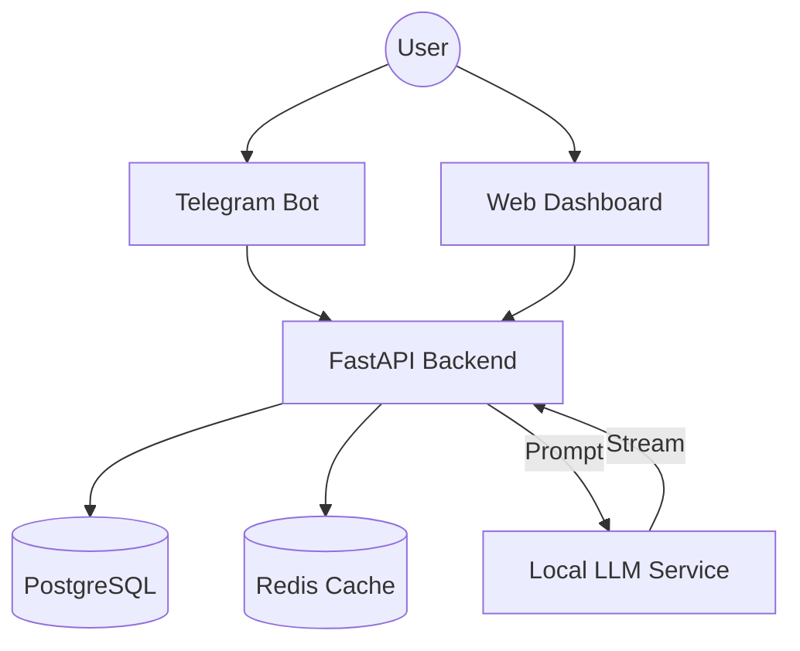

# AI Project Tracker (Self-Hosted LLM) 🧠

**A full-stack task management ecosystem powered by local AI inference.**

This platform integrates a Telegram Bot, Web Dashboard, and a FastAPI backend to help users generate project roadmaps and track progress. Unlike standard wrappers, this project runs a **local LLM (Qwen 2.5 via llama.cpp)** completely offline/self-hosted using Docker.


## 🏗 Architecture

The system relies on a microservices-like architecture orchestrated via Docker Compose:



## 🚀 Key Features

**Self-Hosted Intelligence**: Uses llama.cpp server to run quantized models (GGUF) locally. No OpenAI API keys required.
**Omnichannel**: Manage tasks via Telegram Bot (Aiogram 3) or Web Admin Panel (Next.js).
**AI Generation**: Automatically breaks down a vague idea into 5-7 actionable technical tasks with acceptance criteria.
**Reactive UI**: Real-time progress bars for AI generation on both Web and Telegram.

## 🛠 Tech Stack

**Frontend**: Next.js 14, Tailwind CSS (v4), TypeScript.

**Backend**: FastAPI, SQLAlchemy (Async), Pydantic.

**AI Engine**: llama.cpp python server (OpenAI-compatible endpoint).

**Infrastructure**: Docker, Docker Bake, Caddy (Reverse Proxy).

## ⚡ Quick Start

**Clone & Configure**:

```bash
git clone [https://github.com/vlimkv/ai-project-tracker.git](https://github.com/vlimkv/ai-project-tracker.git)
cp .env.example .env
```

**Launch Ecosystem**:

```bash
# This will download the LLM model (~2GB) on first run
docker compose up -d --build
```

**Access Points**:

**Web UI**: http://localhost:3000

**API Docs**: http://localhost:8000/docs

**LLM Stream**: http://localhost:8080/v1

##⚙️ Environment Variables

The system is highly configurable via .env. Key parameters:

**AI_PROVIDER**: Set to oss for local llama.cpp or openai for cloud fallback.

**OSS_MODEL**: Specify the HuggingFace model tag (default: qwen2.5-3b-instruct).

**REDIS_URL**: For FSM state storage and AI response caching.

## ⚠️ Requirements

**Docker Desktop** installed.

**RAM**: Minimum 4GB (8GB recommended for larger models).

**GPU**: Optional (supports CPU inference via llama.cpp).

---

Developed by Alimkhan Slambek. Architecture demonstrates secure, private AI integration pattern.
